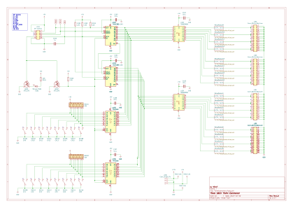
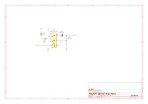

# 鉄道模型用ポイントコントローラ

[English README is here](./README.md)

## 概要
16チャンネルの鉄道模型用ポイントコントローラ。
ポイントの駆動電圧は12Vを想定。

以下の機能をサポートする。機能的には排他。
- マニュアルスイッチによる制御
- 外部SPIインターフェースによる制御

## SPIによる制御
- /SPI_MODE入力をLowにすることでSPI制御モードになる。マニュアルスイッチは無効となり`Manual Mode`のLEDが消灯する。
- SPI Mode0のスレーブデバイスとして動作する。
- データフォーマットは16bit MSB First。(CH16がMSB)
- データ転送後、SSの立ち上がりエッジでポイントへの出力が更新される。
- SSの駆動周期は[C103について](#c103について)を参照。

### 動作例
TOMIX製Nゲージ用電動ポイントのAVRマイコンによる駆動例(動画)

## 回路図
[KiCadのデータ](./16CH-PointController/)

  

### SPIコネクタ仕様
| Pin| Signal    |
|----|-----------|
|  1 | +5V       |
|  2 | +5V       |
|  3 | (N.C)     |
|  4 | MOSI      |
|  5 | (N.C)     |
|  6 | SCLK      |
|  7 | /SPI_MODE |
|  8 | SS        |
|  9 | GND       |
| 10 | GND       |

### C103
電源投入時、74HC595の出力Qnが不定だとリレーがONしてしまう。
これを防止するため、C103を使って電源ONからRCKの立ち上げを遅らせ、出力をLowにしている。
22K, 1uFのRC回路なので充電時間は最大30ms程度かかる。このためSPI制御する場合は駆動周期をこれより長くすること。

### R105
`/SPI_MODE`端子がオープン時、74HC595の`/OE`入力はHigh(>3.15V)に固定される必要がある。
DTC124Eの入力-GND間抵抗は44KΩ(入力・バイアス抵抗はそれぞれ22KΩ）。これらが並列接続されているので、`/OE`の電圧はR105と22KΩ(=44KΩ//44KΩ)で5Vを分圧された値になる。
したがって、R105 * 5 / (R105 + 22K) > 3.15 であることが必要。

## 基板
### 試作
### プリント基板(未製造)

## 免責事項
本リポジトリに含まれる情報を利用することにより生じたあらゆる損害に対し、本リポジトリの情報提供者は一切の責任を負わないものとします。

## License
GPL Version 3